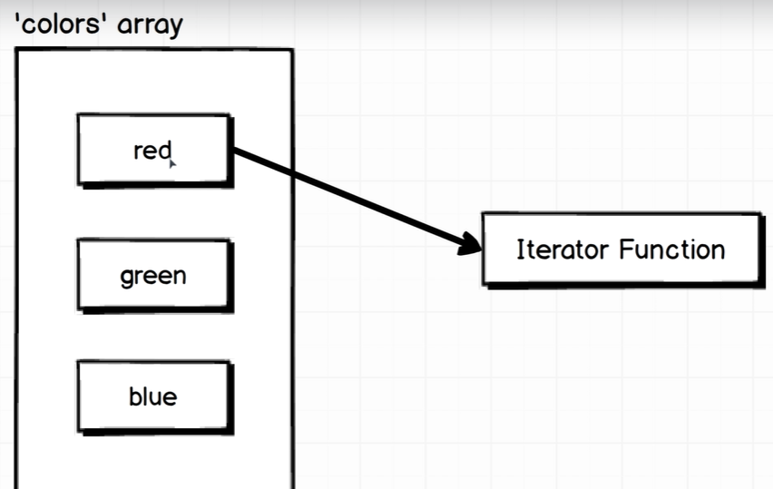

# For Loops in javascript

## ES5 way of for loop
### - We have more syntax in the traditional for loop, which can cause more error
<pre><code>// ES5
for (var i = 0; i < colors.length; i++) {
    console.log(colors[i]);
}
</code></pre>

## ES6 way of for loop
### - It will dramitically reduce the code
<pre><code>// ES6
colors.forEach(function(color) {
    console.log(color);
})
</code></pre>

## Why use forEach?
<pre><code> // emailsThatNeedsToBeDeleted
emails.forEach(function(email) {
    deleteEmail(email);
});
</code></pre>